## 生灭过程相关函数

- `[t, N] = birth_death_N(n_step, lambda, mu)`

  > 返回经历过 `n_step` 次更新之后的所有更新点(包括起点).
  >
  > **输入**
  >
  > > `n_step` : 正整数, 更新步数
  > >
  > > `lambda` : 正常数, 出生率
  > >
  > > `mu` : 正常数, 死亡率
  >
  > **输出**
  >
  > > `t` : 长度为 `n_step+1` 的列向量, 包含起始时刻和 `n_step` 个更新时刻
  > >
  > > `N` : 长度为 `n_step+1` 的列向量, 包含起始位置和 `n_step` 个更新时刻对应的更新位置

  ```matlab
  clc; clear; close all;
  n_step = 50;
  lambda = 1;
  mu = 1;
  [t, N] = birth_death_N(n_step, lambda, mu);
  figure()
  stairs(t, N, '.-')
  xlabel('t')
  ylabel('N')
  ```
  
  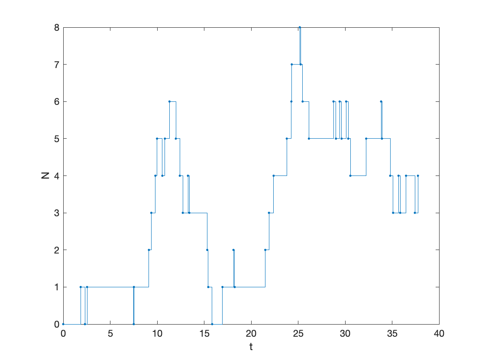

- `[t, N] = birth_death_T(T, lambda, mu)`

  > 返回 `[0, T]` 时间段内的所有更新点(包括两个端点).
  >
  > **输入**
  >
  > > `T` : 正整数, 模拟时长
  > >
  > > `lambda` : 正常数, 出生率
  > >
  > > `mu` : 正常数, 死亡率
  >
  > **输出**
  >
  > > `t` : 列向量, 包含起始时刻、终止时刻以及之间的所有更新时刻
  > >
  > > `N` : 列向量, 包含起始位置、终止位置以及更新时刻所对应的更新位置
  
  ```matlab
  clc; clear; close all;
  T = 50;
  lambda = 1;
  mu = 1;
  [t, N] = birth_death_T(T, lambda, mu);
  figure()
  stairs(t, N, '.-')
  xlabel('t')
  ylabel('N')
  ```
  
  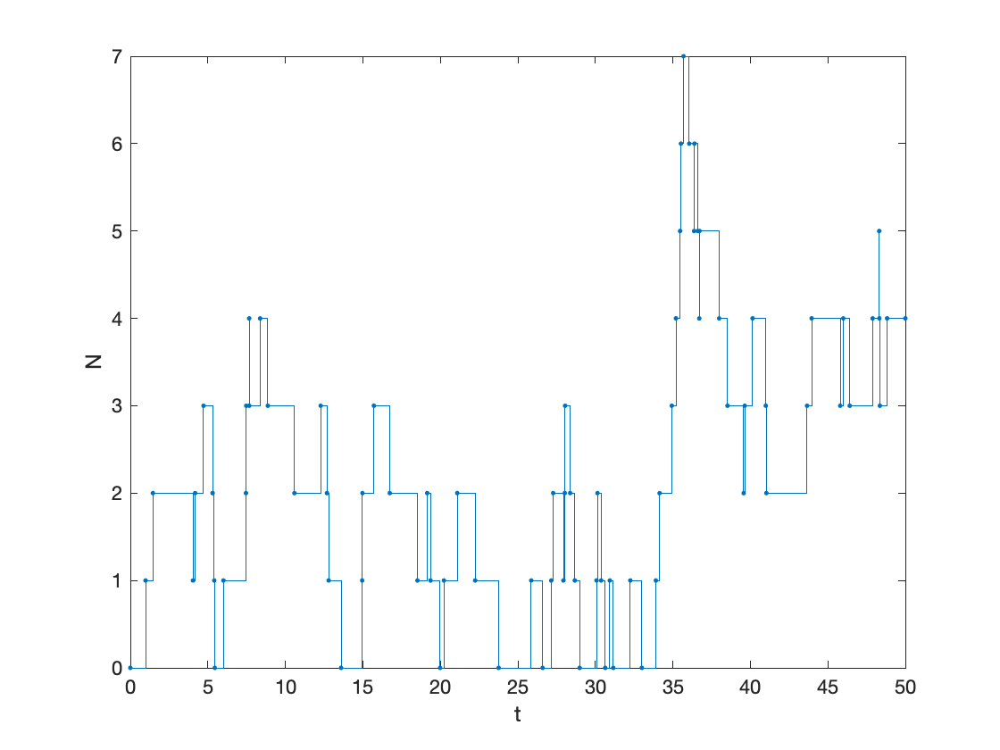

- `[N, varargout] = birth_death_U(T, tau, lambda, mu)` 

  > 返回 `[0, T]` 时间段内步长为 `tau` 的一致剖分时刻 $t_n = n$`tau` 时的位置, $n=0,1,\cdots, N$, $N=\lfloor T/$`tau`$\rfloor$.
  >
  > **输入**
  >
  > > `T` : 正常数, 模拟时长
  > >
  > > `tau` : 正常数, 时间步长
  > >
  > > `lambda` : 正常数, 出生率
  > >
  > > `mu` : 正常数, 死亡率
  >
  > **输出**
  >
  > > `N` : 长度为 $N+1$ 的列向量, 第 $n$ 个元素对应着时刻 $t_n$ 时生灭过程的位置
  >
  > **可选输出** 
  >
  > > `[tt, NN]` : 起始点、终止点以及之间的所有更新点

  ```matlab
  clc; clear; close all;
  T = 10;
  tau = 0.2;
  lambda = 1;
  mu = 1;
  t = (0:tau:T)';
  [N, tt, NN] = birth_death_U(T, tau, lambda, mu);
  figure()
  plot(t, N, '.')
  hold on
  stairs(tt, NN, 'o-')
  xlabel('t')
  ylabel('N')
  legend('一致剖分时刻对应的位置', '实际路径', Location='best')
  %% 或者
  % N = birth_death_U(T, tau, lambda, mu);
  ```

  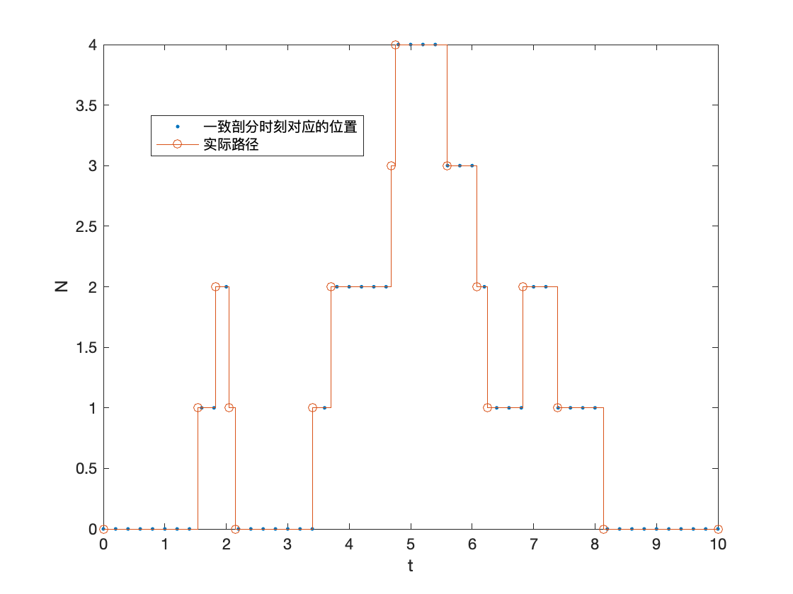

## 扩张媒介下的布朗非高斯聚合物相关函数

- `[t, y, varargout] = BnG(T, a, tau, alpha, beta, n_min, D0, lambda, mu, arg)`

  > 返回 `[0, T]` 时间段步长为 `tau` 的一致剖分时刻点 `t` 及在时刻 `t` 所对应的物理坐标. 
  >
  > **输入**
  >
  > > `T` : 正常数, 模拟时长
  > >
  > > `a` : 函数句柄, 扩张因子
  > >
  > > `tau` : 正常数, 时间步长
  > >
  > > `alpha` : 正常数
  > >
  > > `beta` : $(0,1]$ 之间的正常数
  > >
  > > `n_min` : 正整数
  > >
  > > `D0` : 正常数
  > >
  > > `lambda` : 正常数, 生灭过程的出生率
  > >
  > > `mu`: 正常数, 生灭过程的死亡率
  > >
  > > `arg` : 函数句柄 `a` 的参数
  >
  > **输出**
  >
  > > `t` : 一致剖分的划分点组成的列向量, 第 $n$ 个元素为 $n$`tau`
  > >
  > > `y`: 列向量, 聚合物质心在 `t` 时刻所对应的物理坐标
  >
  > **可选输出**
  >
  > > `x` :  列向量, 聚合物质心在 `t` 时刻所对应的共动坐标

  ```matlab
  clc; clear; close all;
  T = 100;
  power_expanding = @(t, arg) (1+t).^arg;  % 幂律性扩张因子对应的函数句柄
  exp_expanding = @(t, arg) exp(arg*t);    % 指数型扩张因子对应的函数句柄
  tau = 0.1;
  alpha = 1;
  n_min = 3;
  D0 = 1;
  lambda = 1;
  mu = 1;
  % 可直接使用 [t, y1] = BnG(T, a, tau, alpha, beta, n_min, D0, lambda, mu, arg);
  %% 不复合逆从属过程, 指数扩张, H<0
  beta = 1;
  arg = -0.01;
  [t, y1, x1] = BnG(T, exp_expanding, tau, alpha, beta, n_min, D0, lambda, mu, arg);
  figure()
  plot(t, x1)
  hold on
  plot(t, y1)
  xlabel('t')
  ylabel('x(t), y(t)')
  title('不复合逆从属过程, 指数扩张, H=-0.01')
  legend('共动坐标 x(t)', '物理坐标 y(t)', Location='best')
  %% 不复合逆从属过程, 指数扩张, H>0
  beta = 1;
  arg = 0.01;
  [t, y2, x2] = BnG(T, exp_expanding, tau, alpha, beta, n_min, D0, lambda, mu, arg);
  figure()
  plot(t, x2)
  hold on
  plot(t, y2)
  xlabel('t')
  ylabel('x(t), y(t)')
  title('不复合逆从属过程, 指数扩张, H=0.01')
  legend('共动坐标 x(t)', '物理坐标 y(t)', Location='best')
  %% 不复合逆从属过程, 幂律扩张
  beta = 1;
  arg = 0.1;
  [t, y3, x3] = BnG(T, power_expanding, tau, alpha, beta, n_min, D0, lambda, mu, arg);
  figure()
  plot(t, x3)
  hold on
  plot(t, y3)
  xlabel('t')
  ylabel('x(t), y(t)')
  title('不复合逆从属过程, 幂律扩张, \gamma=0.1')
  legend('共动坐标 x(t)', '物理坐标 y(t)', Location='best')
  %% 复合逆从属过程, 指数扩张, H>0
  beta = 0.7;
  arg = 0.02;
  [t, y4, x4] = BnG(T, exp_expanding, tau, alpha, beta, n_min, D0, lambda, mu, arg);
  figure()
  plot(t, x4)
  hold on
  plot(t, y4)
  xlabel('t')
  ylabel('x(t), y(t)')
  title('复合逆从属过程, 指数扩张, H=0.02, \beta=0.7')
  legend('共动坐标 x(t)', '物理坐标 y(t)', Location='best')
  %% 复合逆从属过程, 指数扩张, H<0
  beta = 0.7;
  arg = -0.02;
  [t, y5, x5] = BnG(T, exp_expanding, tau, alpha, beta, n_min, D0, lambda, mu, arg);
  figure()
  plot(t, x5)
  hold on
  plot(t, y5)
  xlabel('t')
  ylabel('x(t), y(t)')
  title('复合逆从属过程, 指数扩张, H=-0.02, \beta=0.7')
  legend('共动坐标 x(t)', '物理坐标 y(t)', Location='best')
  %% 复合逆从属过程, 幂律扩张
  beta = 0.7;
  arg = 0.5;
  [t, y6, x6] = BnG(T, power_expanding, tau, alpha, beta, n_min, D0, lambda, mu, arg);
  figure()
  plot(t, x6)
  hold on
  plot(t, y6)
  xlabel('t')
  ylabel('x(t), y(t)')
  title('复合逆从属过程, 幂律扩张, \gamma=0.5, \beta=0.7')
  legend('共动坐标 x(t)', '物理坐标 y(t)', Location='best')
  ```

 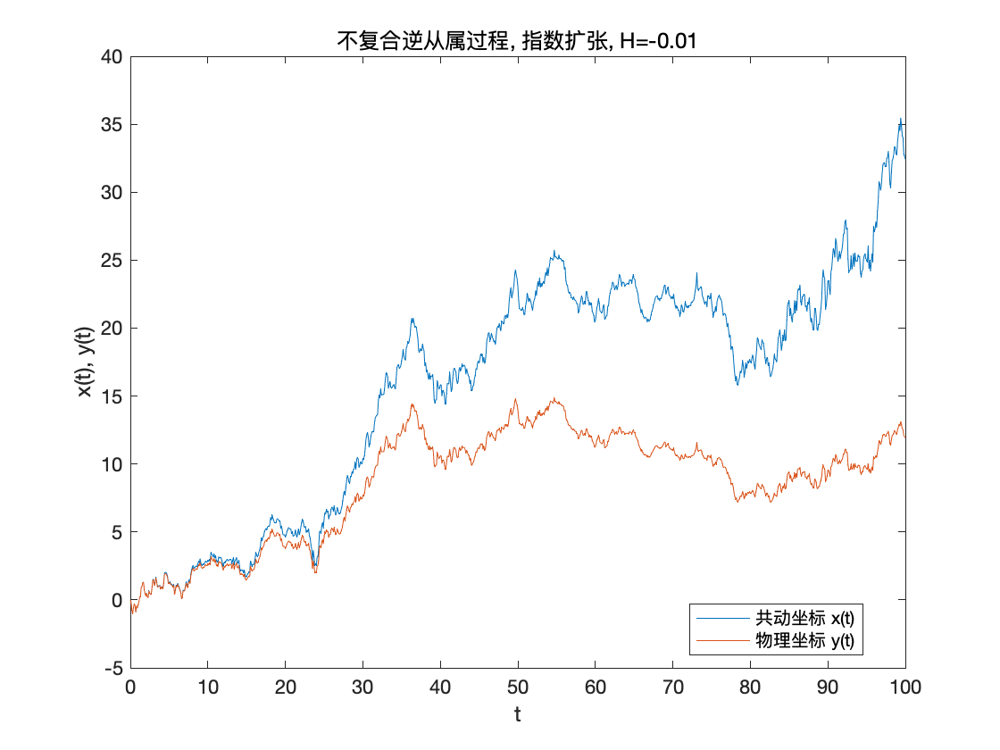
 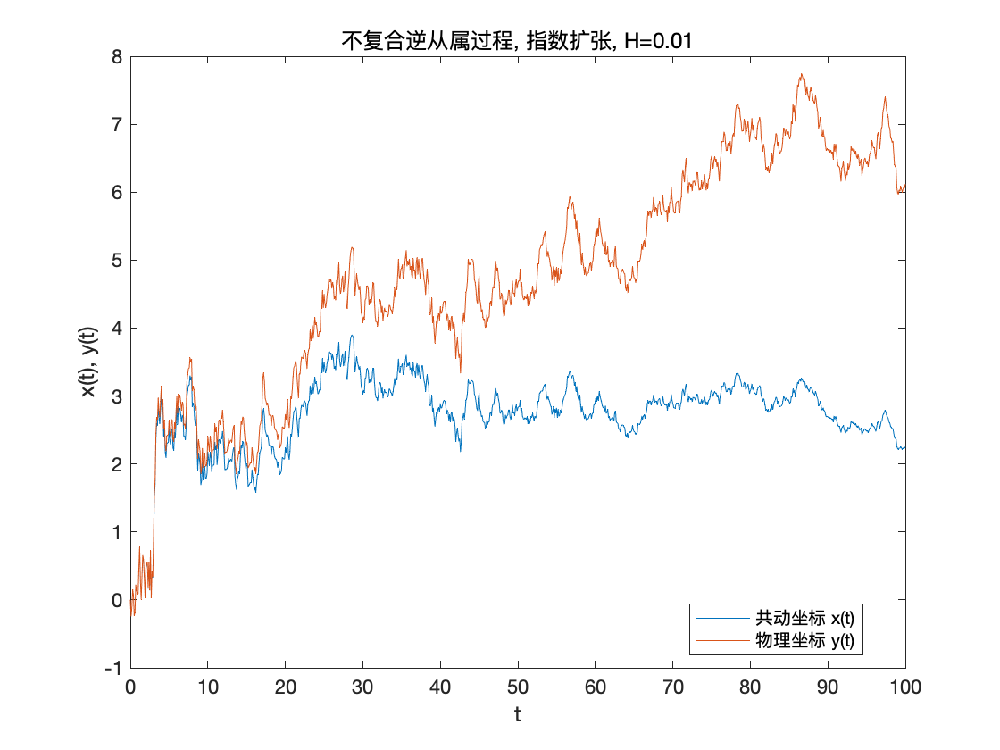
 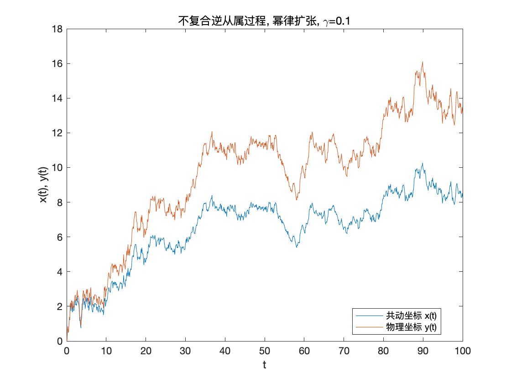
 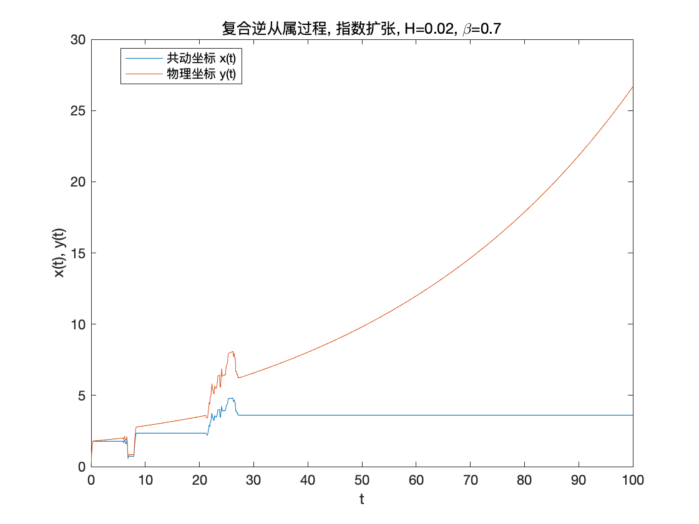
 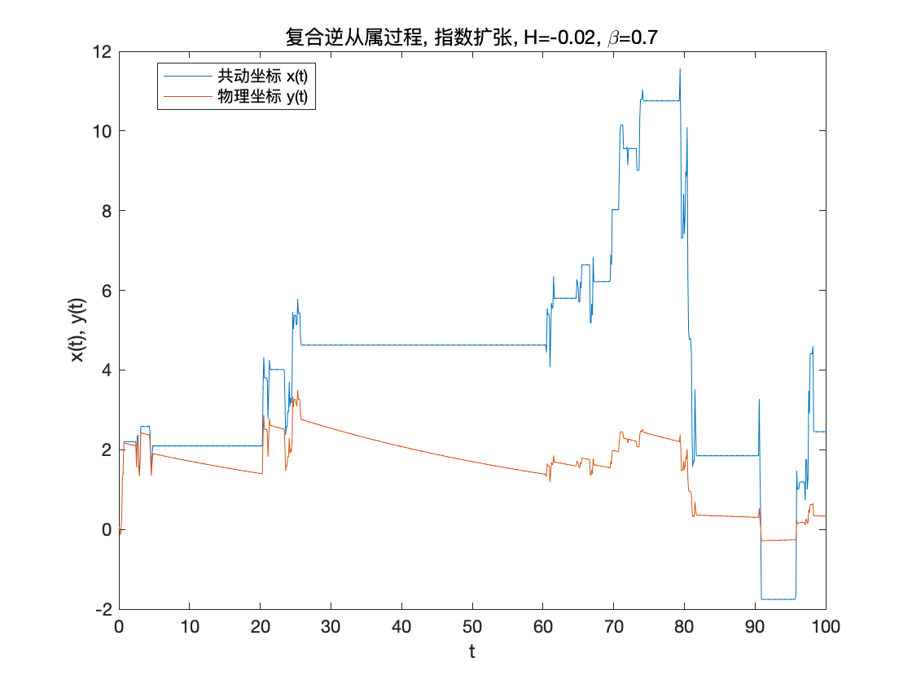
 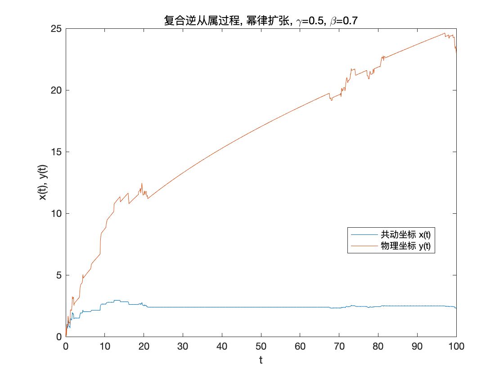

- `m=EAMSD(M, T, a, tau, alpha, beta, n_min, D0, lambda, mu, arg)`

  > ! **需用到并行计算工具箱**
  >
  > 蒙特卡罗模拟质心物理坐标的均方位移(系综平均).
  >
  > **输入**
  >
  > > `M` : 正整数, 蒙特卡罗模拟的粒子数
  > >
  > > `T` : 递增列向量, 想要模拟系综平均的那些时刻
  > >
  > > 其他参数同上
  >
  > **输出**
  >
  > > `m` : 列向量, `T` 所对应的系综平均

  示例: 
  
  ```matlab
  clc; clear; close all;
  M = 1d4;
  power_expanding = @(t, arg) (1+t).^arg;  % 幂律性扩张因子对应的函数句柄
  exp_expanding = @(t, arg) exp(arg*t);    % 指数型扩张因子对应的函数句柄
  tau = 0.1;
  alpha = 1;
  n_min = 3;
  D0 = 1;
  lambda = 1;
  mu = 1;
  
  %% 指数扩张, H>0
  T = (10:5:300)';
  arg = 0.1;
  m1 = EAMSD(M, T, exp_expanding, tau, alpha, 1, n_min, D0, lambda, mu, arg);
  m2 = EAMSD(M, T, exp_expanding, tau, alpha, 0.7, n_min, D0, lambda, mu, arg);
  m3 = EAMSD(M, T, exp_expanding, tau, alpha, 0.3, n_min, D0, lambda, mu, arg);
  figure()
  loglog(T, m1, 'o')
  hold on
  loglog(T, m2, '*')
  hold on
  loglog(T, m3, 's')
  hold on
  loglog(T, exp(2*arg*T))
  xlabel('t')
  ylabel('\langle y^2(t)\rangle')
  legend('$\beta=1$', '$\beta=0.7$', '$\beta=0.3$', '$\exp{(2Ht)}$', ...
      'Interpreter','latex', Location='best')
  title('指数扩张, H=0.1')
  
  %% 指数扩张, H<0
  T = (500:10:1000)';
  arg = -0.01;
  m4 = EAMSD(M, T, exp_expanding, tau, alpha, 1, n_min, D0, lambda, mu, arg);
  m5 = EAMSD(M, T, exp_expanding, tau, alpha, 0.7, n_min, D0, lambda, mu, arg);
  m6 = EAMSD(M, T, exp_expanding, tau, alpha, 0.5, n_min, D0, lambda, mu, arg);
  figure()
  loglog(T, m4, 'o')
  hold on
  loglog(T, m5, '*')
  hold on
  loglog(T, m6, 's')
  hold on
  loglog(T, 11.5*T.^0)
  hold on
  loglog(T, 9*T.^(-0.3))
  hold on
  loglog(T, 7*T.^(-0.5))
  txt1 = 'slope=-0.5';
  text(T(26), 6*T(26)^(-0.5), txt1, 'Fontsize', 14)
  txt2 = 'slope=-0.3';
  text(T(26), 8*T(26)^(-0.3), txt2, 'Fontsize', 14)
  txt3 = 'slope=0';
  text(T(26), 10, txt3, 'Fontsize', 14)
  xlabel('t')
  ylabel('\langle y^2(t)\rangle')
  legend('$\beta=1$', '$\beta=0.7$', '$\beta=0.5$', ...
      'Interpreter','latex', Location='best')
  title('指数扩张, H=-0.01')
  
  %% 幂律扩张, beta=1
  T = (10:5:300)';
  beta = 1;
  m7 = EAMSD(M, T, power_expanding, tau, alpha, beta, n_min, D0, lambda, mu, 1);
  m8 = EAMSD(M, T, power_expanding, tau, alpha, beta, n_min, D0, lambda, mu, 0.7);
  m9 = EAMSD(M, T, power_expanding, tau, alpha, beta, n_min, D0, lambda, mu, 0.4);
  figure()
  loglog(T, m7, 'o')
  hold on
  loglog(T, m8, 's')
  hold on
  loglog(T, m9, '*')
  hold on 
  loglog(T, T.^2)
  hold on
  loglog(T, 2*T.^(1.4))
  hold on
  loglog(T, 2*T)
  txt4 = 'slope=2';
  text(T(21), 0.7*T(21)^(2), txt4, 'Fontsize', 14)
  txt5 = 'slope=1.4';
  text(T(21), 1.5*T(21)^(1.4), txt5, 'Fontsize', 14)
  txt6 = 'slope=1';
  text(T(21), 1.5*T(21), txt6, 'Fontsize', 14)
  xlabel('t')
  ylabel('\langle y^2(t)\rangle')
  legend('$\gamma=1$', '$\gamma=0.7$', '$\gamma=0.4$', ...
      'Interpreter','latex', Location='best')
  title('幂律扩张, \beta=1')
  
  %% 幂律扩张, beta=0.7
  T = (10:5:300)';
  beta = 1;
  m10 = EAMSD(M, T, power_expanding, tau, alpha, beta, n_min, D0, lambda, mu, 1);
  m11 = EAMSD(M, T, power_expanding, tau, alpha, beta, n_min, D0, lambda, mu, 0.4);
  m12 = EAMSD(M, T, power_expanding, tau, alpha, beta, n_min, D0, lambda, mu, 0.3);
  figure()
  loglog(T, m10, 'o')
  hold on
  loglog(T, m11, 's')
  hold on
  loglog(T, m12, '*')
  hold on 
  loglog(T, T.^2)
  hold on
  loglog(T, 4.1*T.^(0.8))
  hold on
  loglog(T, 2.5*T.^(0.7))
  txt7 = 'slope=2';
  text(T(21), 0.8*T(21)^(2), txt7, 'Fontsize', 14)
  txt8 = 'slope=0.8';
  text(T(21), 6*T(21)^(0.8), txt8, 'Fontsize', 14)
  txt9 = 'slope=0.7';
  text(T(21), 2*T(21)^(0.7), txt9, 'Fontsize', 14)
  xlabel('t')
  ylabel('\langle y^2(t)\rangle')
  legend('$\gamma=1$', '$\gamma=0.4$', '$\gamma=0.3$', ...
      'Interpreter','latex', Location='best')
  title('幂律扩张, \beta=0.7')
  ```
  
  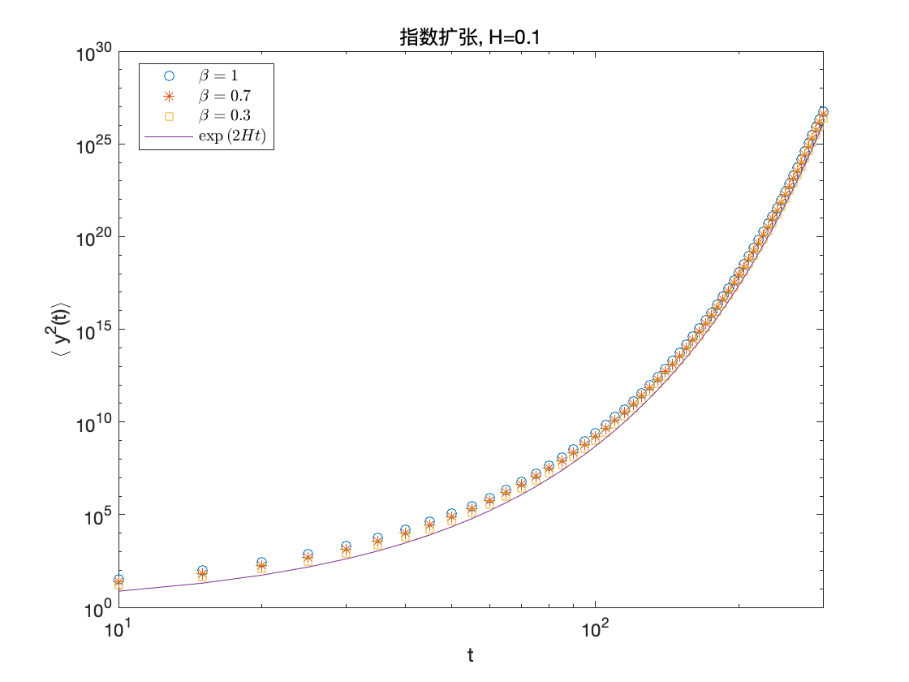
  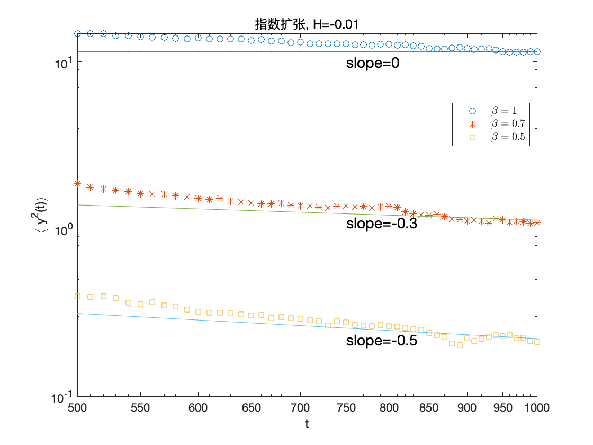
  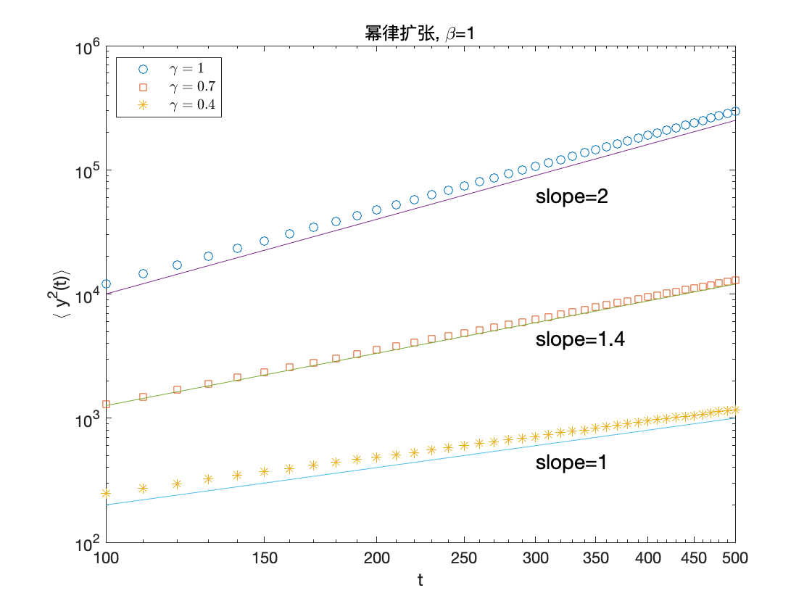
  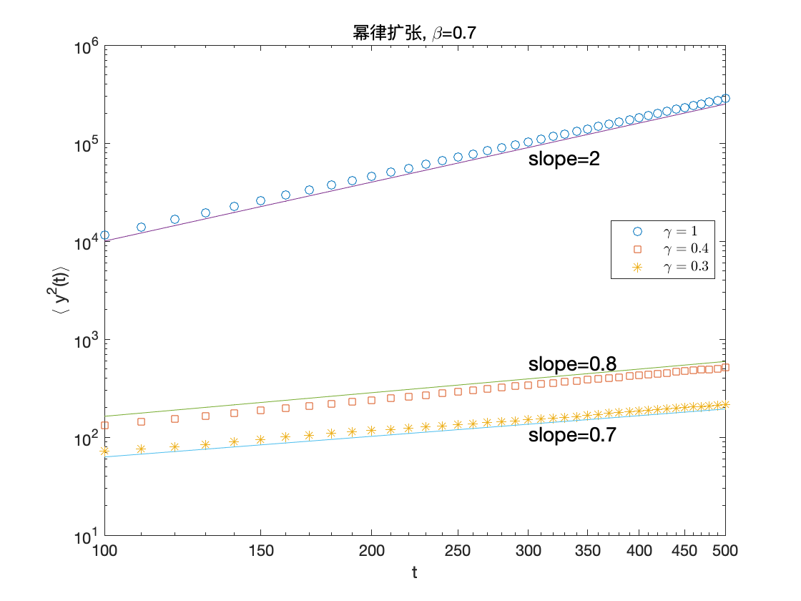

- `m = EATAMSD(M, T, delta, a, alpha, beta, n_min, D0, lambda, mu, arg)`

  > ! **需用到并行计算工具箱**
  >
  > 蒙特卡罗模拟质心物理坐标时间平均的系综平均. 
  >
  > **输入**
  >
  > > `T` : 正常数, 观测时长
  > >
  > > `delta` : 正常数
  > >
  > > 其他参数同上
  >
  > **输出**
  >
  > > `m` : 时间平均的系综平均

  ```matlab
  clc; clear; close all;
  M = 1d4;
  power_expanding = @(t, arg) (1+t).^arg;  % 幂律性扩张因子对应的函数句柄
  exp_expanding = @(t, arg) exp(arg*t);    % 指数型扩张因子对应的函数句柄
  tau = 0.1;
  alpha = 1;
  n_min = 3;
  D0 = 1;
  lambda = 1;
  mu = 1;
  T = 100;
  delta = (1e-2:1e-2:1)';
  n = length(delta);
  %% 幂律扩张, beta=1
  beta = 1;
  m1 = zeros(n, 1);
  for k=1:n
  	  m1(k) = EATAMSD(M, T, delta(k), power_expanding, alpha, beta, n_min, D0, lambda, mu, 1);
  end
  ```
